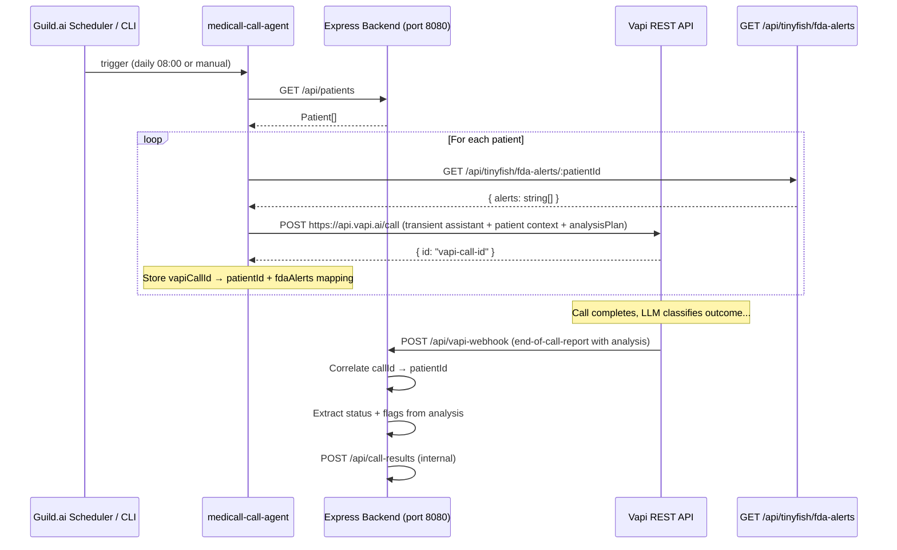

# Design Document: Vapi + Guild.ai Integration

## Overview

This design covers Person 1's integration scope for the MediCall hackathon: wiring Vapi outbound voice calls and Guild.ai agent orchestration into Person 2's existing Express backend. The system initiates daily medication adherence calls to elderly patients, receives transcripts via webhook, classifies outcomes, and POSTs results to the existing `/api/call-results` endpoint.

The design prioritizes hackathon speed — minimal new files, direct integration with the existing Express app, and fallback modes for every external dependency.

### Key Design Decisions

1. **Vapi handles the AI conversation AND classification** — Vapi's assistant runs the full voice call with its built-in LLM (STT → LLM → TTS). The system prompt instructs the assistant to conduct the medication check conversation AND produce a structured JSON classification in the end-of-call report's `analysis` field. No separate classifier module needed — Vapi's LLM does it all in one pass.

2. **Transient Vapi assistants** — each call creates an inline assistant with patient-specific context (name, meds, FDA alerts) rather than pre-saving assistants in the Vapi dashboard. This avoids dashboard setup and lets us inject dynamic context per-call.

3. **In-process webhook** — the `/api/vapi-webhook` route lives in the same Express server rather than a separate service. Simpler deployment for a hackathon.

4. **In-memory call ID map** — a `Map<string, string>` (vapiCallId → patientId) correlates webhook callbacks to patients. Acceptable for a single-process hackathon demo.

5. **Guild.ai first** — the Guild agent is the orchestration brain. Build it first, then wire Vapi into it as a tool. If Guild.ai SDK is unavailable, the same pipeline is callable via a plain TypeScript function.

6. **Structured output via Vapi analysis plan** — Vapi supports an `analysisPlan` on the assistant that instructs the LLM to produce structured data at call end. We use this to get `{ status, flags }` directly from Vapi's end-of-call-report, eliminating the need for a separate classification step.

## Architecture



### Component Layout

All new code lives under `MediCall/src/` alongside Person 2's existing modules:

```
MediCall/src/
├── services/
│   └── vapi.ts              # NEW — Vapi REST client (create call, build assistant prompt)
├── routes/
│   └── api.ts               # MODIFIED — add POST /api/vapi-webhook route
├── guild/
│   └── medicall-call-agent.ts  # NEW — Guild.ai agent definition + pipeline orchestrator
├── config.ts                # MODIFIED — add Vapi key config
├── store.ts                 # MODIFIED — add callIdMap for webhook correlation
└── types.ts                 # EXISTING — no changes needed
```

No separate `classifier.ts` — Vapi's LLM handles classification via the `analysisPlan`.

## Components and Interfaces

### 1. Vapi Service (`src/services/vapi.ts`)

Responsible for creating outbound calls via the Vapi REST API with AI-powered conversation and classification.

```typescript
interface VapiCallRequest {
  patientName: string;
  patientPhone: string;       // E.164 format: +1XXXXXXXXXX
  medications: string[];
  fdaAlerts: string[];
  serverUrl: string;          // webhook URL for end-of-call-report
}

interface VapiCallResponse {
  id: string;                 // Vapi call ID
}

async function createOutboundCall(req: VapiCallRequest): Promise<VapiCallResponse>
function buildAssistantPrompt(patientName: string, medications: string[], fdaAlerts: string[]): string
```

Implementation details:
- `POST https://api.vapi.ai/call` with `Authorization: Bearer <vapi-private-key>`
- Uses a transient `assistant` object (not `assistantId`) with an inline system prompt
- Sets `assistant.model.provider: "openai"`, `assistant.model.model: "gpt-4o-mini"`
- Sets `assistant.voice` to a calm, clear voice provider (e.g., `eleven_labs` or Vapi default)
- Sets `assistant.serverUrl` to `{APP_URL}/api/vapi-webhook` for webhook delivery
- Configures `assistant.analysisPlan.structuredDataPlan` to instruct the LLM to produce:
  ```json
  {
    "status": "took_meds | missed_meds | no_answer | concern",
    "flags": ["dizziness", "chest_pain", ...]
  }
  ```
- The `structuredDataPlan.schema` defines the JSON schema for the classification output
- The `structuredDataPlan.messages` array contains a system prompt explaining classification rules
- 10-second fetch timeout via `AbortSignal.timeout(10000)`; throw on failure to trigger fallback
- The `customer.number` field is set to the patient's phone number

#### System Prompt Design

The assistant system prompt instructs the Vapi LLM to:
1. Greet the patient by name in a warm, elder-friendly tone
2. Ask about each medication by name ("Did you take your [medication] today?")
3. Ask about general wellbeing ("How are you feeling today?")
4. If FDA alerts exist, mention them naturally ("I also wanted to let you know about a safety notice regarding [medication]...")
5. Keep language simple, speak slowly, and be patient with responses
6. If the patient mentions any health concerns (dizziness, chest pain, confusion, falls, nausea), acknowledge them compassionately and note them

#### Analysis Plan Design

The `analysisPlan.structuredDataPlan` tells Vapi's LLM to analyze the completed conversation and produce:
- `status`: one of `took_meds`, `missed_meds`, `no_answer`, `concern` based on the conversation outcome
- `flags`: array of specific concern indicators mentioned (e.g., `["dizziness", "chest_pain"]`)

Classification rules embedded in the analysis prompt:
- `concern` takes priority — any health concern mentioned → `concern` with flags
- `took_meds` — patient confirmed taking medications
- `missed_meds` — patient denied or forgot medications
- `no_answer` — call not answered or went to voicemail

### 2. Webhook Route (addition to `src/routes/api.ts`)

New `POST /api/vapi-webhook` endpoint.

```typescript
// Vapi end-of-call-report payload shape (relevant fields)
interface VapiWebhookPayload {
  message: {
    type: "end-of-call-report";
    call: { id: string };
    endedReason: string;
    artifact: {
      transcript: string;
      messages: Array<{ role: string; message: string }>;
    };
    analysis: {
      structuredData: {
        status: string;
        flags: string[];
      };
    };
  };
}
```

Endpoint behavior:
1. Extract `message.type` — only process `"end-of-call-report"`, respond 200 to all others
2. Extract `message.call.id`, `message.artifact.transcript`, and `message.analysis.structuredData`
3. Look up patientId and stored fdaAlerts from `callIdMap` using the Vapi call ID
4. If not found → respond 404, log warning
5. Read `status` and `flags` directly from `analysis.structuredData` (Vapi's LLM already classified it)
6. If `structuredData` is missing or invalid, fall back to `missed_meds` with empty flags as a safe default
7. If `endedReason` is `"no-answer"` or `"voicemail"`, override status to `no_answer`
8. Build call result payload and POST to `/api/call-results` (or call `addCallResult` directly)
9. Respond 200 to Vapi

### 3. Guild.ai Agent (`src/guild/medicall-call-agent.ts`)

The orchestration entry point using `@guildai/agents-sdk`.

```typescript
import { llmAgent, guildTools } from "@guildai/agents-sdk";

// Pipeline function (also callable standalone without Guild)
async function runCallPipeline(backendUrl: string): Promise<void>

// Guild agent definition
export default llmAgent({
  description: "MediCall daily medication adherence call agent",
  tools: { ...guildTools },
  systemPrompt: `You are the MediCall orchestration agent. When triggered, run the daily medication adherence call pipeline...`,
  mode: "one-shot",
});
```

Pipeline steps (sequential per patient):
1. `GET {backendUrl}/api/patients` → `Patient[]`
2. For each patient:
   a. `GET {backendUrl}/api/tinyfish/fda-alerts/{patient_id}` → `{ alerts: string[] }`
   b. `createOutboundCall({ patientName, patientPhone, medications, fdaAlerts, serverUrl })`
   c. Store `vapiCallId → { patient_id, fdaAlerts }` in `callIdMap`
   d. On Vapi failure → inject fallback transcript, POST directly to `/api/call-results`
3. Log completion summary

### 4. Call ID Map (addition to `src/store.ts`)

```typescript
interface CallMapping {
  patientId: string;
  fdaAlerts: string[];
}

export const callIdMap = new Map<string, CallMapping>();

export const setCallMapping = (vapiCallId: string, patientId: string, fdaAlerts: string[]): void => {
  callIdMap.set(vapiCallId, { patientId, fdaAlerts });
};

export const getCallMapping = (vapiCallId: string): CallMapping | undefined => {
  return callIdMap.get(vapiCallId);
};
```

### 5. Config Additions (`src/config.ts`)

```typescript
vapiPrivateKey: getEnv("vapi-private-key"),
vapiPublicKey: process.env["vapi-public-key"] ?? "",
vapiApiUrl: process.env.VAPI_API_URL ?? "https://api.vapi.ai",
```

## Data Models

### Existing Models (no changes)

- **Patient** — `patientSchema` in `src/types.ts`
- **CallResult** — `callResultSchema` in `src/types.ts`
- **CallStatus** — `callStatusSchema` enum: `took_meds | missed_meds | no_answer | concern`

### New Data Structures

**VapiWebhookPayload** (runtime, not persisted):
```typescript
{
  message: {
    type: string;
    call: { id: string };
    endedReason: string;
    artifact: {
      transcript: string;
      messages: Array<{ role: "assistant" | "user"; message: string }>;
    };
    analysis: {
      structuredData: {
        status: "took_meds" | "missed_meds" | "no_answer" | "concern";
        flags: string[];
      };
    };
  };
}
```

**CallMapping** (in-memory):
- Key: Vapi call ID (string)
- Value: `{ patientId: string, fdaAlerts: string[] }`

**FallbackTranscript** (constant):
```typescript
{
  status: "took_meds",
  transcript: "Fallback: Vapi unavailable. Simulated successful call.",
  flags: [],
  fda_alerts: []
}
```

### Data Flow

1. **Call initiation** → Vapi returns `{ id }` → stored in `callIdMap` with patientId + fdaAlerts
2. **Vapi conducts AI conversation** → LLM greets patient, asks about meds, checks wellbeing
3. **Vapi classifies at call end** → `analysisPlan` produces `{ status, flags }` via LLM
4. **Webhook receipt** → Vapi sends `end-of-call-report` with transcript + analysis
5. **Result posting** → webhook handler reads status/flags from analysis, assembles CallResult, POSTs to `/api/call-results`

## Correctness Properties

### Property 1: Prompt builder includes all patient context

*For any* patient name (non-empty string), any non-empty medications list, and any FDA alerts array (including empty), the string returned by `buildAssistantPrompt(name, medications, fdaAlerts)` SHALL contain the patient name, every medication string, and every FDA alert string.

**Validates: Requirements 1.2, 5.2**

### Property 2: Call ID mapping round-trip

*For any* pair of (vapiCallId, patientId, fdaAlerts) values, storing via `setCallMapping` and retrieving via `getCallMapping` SHALL return the original patientId and fdaAlerts.

**Validates: Requirements 1.4, 2.3**

### Property 3: Webhook always produces a valid status

*For any* webhook payload received, the resulting call result SHALL have a status that is exactly one of `"took_meds"`, `"missed_meds"`, `"no_answer"`, or `"concern"`. If `analysis.structuredData` is missing or contains an invalid status, the webhook SHALL default to `"missed_meds"`.

**Validates: Requirements 3.1**

## Error Handling

### Vapi API Failures (Requirement 8)
- 10-second fetch timeout. On timeout or non-2xx, inject fallback transcript.
- Fallback: `{ status: "took_meds", transcript: "Fallback: Vapi unavailable. Simulated successful call.", flags: [], fda_alerts: [] }`
- Log `console.warn` with error details.

### Missing Analysis Data
- If `analysis.structuredData` is missing from webhook, default to `status: "missed_meds"`, `flags: []`
- If `endedReason` is `"no-answer"` or `"voicemail"`, override to `status: "no_answer"`

### FDA Alert Fetch Failures (Requirement 5.3)
- Proceed with `fda_alerts: []`, log failure.

### Webhook Correlation Failures (Requirement 2.4)
- Unknown call ID → HTTP 404, log warning.

### Guild.ai Scheduler Failures (Requirement 9)
- `runCallPipeline()` exported standalone. Works via CLI or script if Guild.ai is down.

## Testing Strategy

### Property-Based Tests (fast-check)
- **Property 1**: Random (name, meds[], alerts[]) → verify prompt contains all
- **Property 2**: Random (callId, patientId, alerts[]) → verify mapping round-trip
- **Property 3**: Random webhook payloads → verify valid status output

### Manual Demo Tests
- Trigger pipeline → verify call result appears on dashboard
- Concern scenario → verify `alert_sent: true`
- FDA alert scenario → verify Metformin alert in `fda_alerts`
- Vapi down → verify fallback transcript posted
